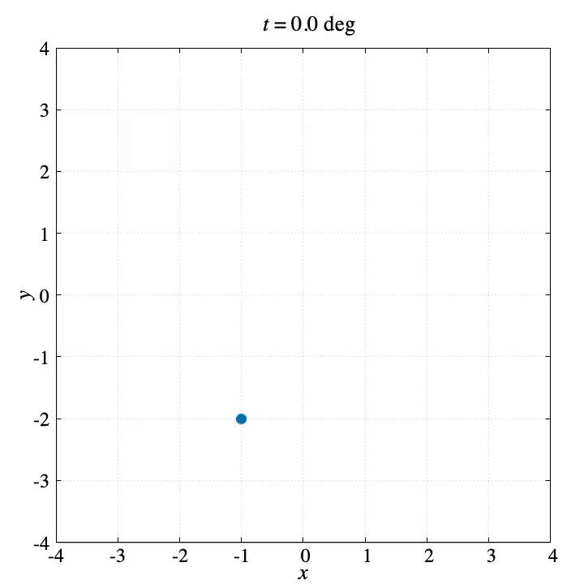

# Rounded Pentagram
"rounded-pentagram" is a graphing program of a parametric curve with gnuplot.
To create this program, I referenced the following tweet.

**<blockquote class="twitter-tweet"><p lang="ja" dir="ltr">丸みを帯びた五芒星の媒介変数表示 <a href="https://t.co/qI8HCVfzJm">pic.twitter.com/qI8HCVfzJm</a></p>&mdash; 千葉大数学科18 (@chibamath18) <a href="https://twitter.com/chibamath18/status/1406756501004251136?ref_src=twsrc%5Etfw">June 20, 2021</a></blockquote>**

## Demo



## Parametric equations


## Features
You enable to switch terminal type `qt` or `pngcairo` by using **`qtMode`**.
- If you select `qt` terminal (`qtMode==1`), gnuplot opens qt window and you can run this simulator.
The drawing speed of the qt window can be adjusted with the `pause` command.
```
pause 0.001     # Adjust the drawing speed
```
- On the other hand, in `pngcairo` terminal (`qtMode!=1`), you can get a lot of PNG images of the simulation.
By using the outputted images, you can make a video or an animated GIF.

- The parametric equations of the curve consist only of trigonometric functions.
**This property makes it possible to draw rotating circles.**
If you want to draw rotating circles with the curve, please refer to the files containing **"with_circles"** or **"with_rotating_circles"** in this repository.

<!-- # Operating environment -->
## Requirement
- macOS Big Sur 11.4 / Macbook Air (M1, 2020) 16GB
- gnuplot version 5.4 patchlevel 1
- VScode 1.56.2
- FFmpeg 4.4

<!-- # Installation -->
 
## Usage
```
git clone https://github.com/hiroloquy/rounded-pentagram.git
cd rounded-pentagram
gnuplot
load 'rounded_pentagram.plt'
```

## Note
I made a MP4 file (demo.mp4) and an animated GIF (demo.gif) by using **FFmpeg**.

### MP4
#### Without rotating circles
```
cd rounded-pentagram
ffmpeg -framerate 60 -i png/img_%04d.png -vcodec libx264 -pix_fmt yuv420p -vf "scale=trunc(iw/2)*2:trunc(ih/2)*2" -r 60 demo.mp4
```
#### With rotating circles
```
cd rounded-pentagram
ffmpeg -framerate 60 -i png_with_circles/img_%04d.png -vcodec libx264 -pix_fmt yuv420p -vf "scale=trunc(iw/2)*2:trunc(ih/2)*2" -r 60 demo_with_circles.mp4
```

### GIF
#### Without rotating circles
```
cd rounded-pentagram
ffmpeg -i demo.mp4 -filter_complex "[0:v] fps=30,split [a][b];[a] palettegen [p];[b][p] paletteuse" demo.gif
```
#### With rotating circles
```
cd rounded-pentagram
ffmpeg -i demo_with_circles.mp4 -filter_complex "[0:v] fps=30,split [a][b];[a] palettegen [p];[b][p] paletteuse" demo_with_circles.gif
```

## Author
* Hiro Shigeyoshi
* Twitter: [@hiroloquy](https://twitter.com/hirloquy)

### Blog
This article is written in detail and in Japanese. You can translate it in your language.  
https://hiroloquy.com/2021/07/11/rounded-pentagram-animation/

### YouTube
http://www.youtube.com/watch?v=kD-hhFuiSmM  
[](http://www.youtube.com/watch?v=kD-hhFuiSmM "Rounded Pentagram: Pseudo Fourier Series Animation Using Gnuplot")

## License
"rounded-pentagram" is under [MIT license](https://github.com/hiroloquy/rounded-pentagram/blob/master/LICENSE).
 
